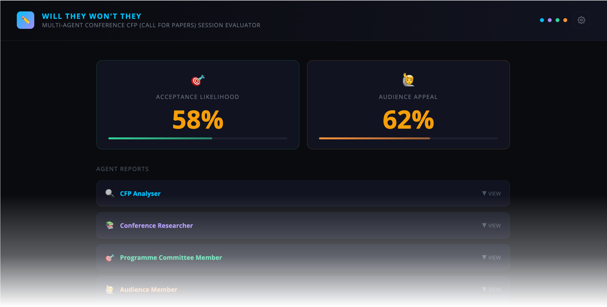

<h1 align="center">✏️ Will They Won't They</h1>
<div align="center">A Multi-Agent Conference CFP (Call for Papers) Session Evaluator</div>
</br>
<div align="center">

</div>

---

<div align="center">
    </br>
    
    
    
    
    
    
    
</div>

---

> 🚨 This release works only for **Anthropic LLMs API keys**. Further releases will include support for other vendors.

---

You have something worth sharing. Conference organisers put real effort into curating sessions that serve their community. **They deserve submissions that are clear, relevant, and well-argued.**

This tool helps you stress-test your abstract before you submit it. Not to game the process, but to make sure your idea comes across the way you intend it to.

Your abstract is put in front of four AI agents, each reading it from a different angle: the person who wrote the call for papers, someone who knows the conference inside out, a programme committee reviewer, and a typical attendee. A fifth agent, the Synthesiser, reads all their outputs and gives you a consolidated report with rewrite suggestions.


## ⚙️ How It Works: The Agent Workflow

You provide your session title, abstract, and the conference's CFP URL. The agents then run in sequence, each building on the work of those before it.

```
analyser [🔍] ──────────────► committee [🎯] ──┐
                              ▲           ├──► synthesiser [🧠]
researcher [📚] ──────────────┘           │
             └──► audience [🙋] ──────────┘
```

### 🤖 The Agents

| Agent | Role | Inputs | What it produces |
|---|---|---|---|
| 🔍 **CFP Analyser** | Extracts key requirements from the Call for Papers | CFP URL | Themes, formats, audience, hard rules, hidden signals, CFP questions |
| 📚 **Conference Researcher** | Researches past accepted sessions and conference DNA | Event URL | Ethos, accepted talk patterns, rejection signals, trending topics, speaker archetypes |
| 🎯 **Programme Committee Member** | Evaluates from the committee's perspective | Abstract + CFP analysis [🔍] + conference research [📚] | Scores on relevance, originality, clarity, credibility and value; top 3 rejection risks; top 3 edits |
| 🙋 **Audience Member** | Evaluates from the attendee's perspective | Abstract + conference research [📚] | Scores on click-worthiness, clarity and FOMO; most compelling thing; biggest hesitation; title rewrite suggestion |
| 🧠 **Synthesiser** | A senior conference coach | Committee [🎯] + Audience [🙋] evaluations | Composite scores, strengths, weaknesses, 2 title rewrites, full abstract rewrite, 5 ranked edits |

## 🚀 Deployment

The app runs as two Docker containers managed by Docker Compose:

- **`will-they-wont-they-cfp-app`**, the React frontend, built with Vite and served by nginx on port `8080`
- **`will-they-wont-they-cfp-proxy`**, a lightweight Node.js proxy that forwards requests to the Anthropic API

### 📋 Requirements

- Docker and Docker Compose installed
- An [Anthropic API key](https://console.anthropic.com/settings/keys)

### ⚙️ Extra setup

To adjust what the agents say or how they behave, edit [`src/prompts.yaml`](/src/prompts.yaml) and rebuild the container.

The default port for the web browser is `8080`. You can change it in the [`docker-compose.yml`](/docker-compose.yml) file, under the `will-they-wont-they-cfp-app` service.

### ▶️ Running

```bash
docker compose up --build -d
```

To verify the creation of the containers, run the following command:

```bash
docker ps
```

You should see the two containers with their corresponding ports open:

```bash
CONTAINER ID   IMAGE                                                   COMMAND                  CREATED         STATUS         PORTS                  NAMES
4a3dd5a3a76a   will-they-wont-they-cfp-app:latest                      "/docker-entrypoint.…"   5 seconds ago   Up 4 seconds   0.0.0.0:8080->80/tcp   will-they-wont-they-cfp-app
228c9c47c579   will-they-wont-they-cfp-will-they-wont-they-cfp-proxy   "docker-entrypoint.s…"   5 seconds ago   Up 4 seconds   3001/tcp               will-they-wont-they-cfp-proxy
```

### ⏹️ Stopping

```bash
docker compose down
```

### ✏️ How to Use

1. Open [http://localhost:8080](http://localhost:8080) in your browser.

2. Click on the **⚙ Settings** panel and setup your Anthropic Claude API key. This key is stored in your browser's `localStorage`. It is never persisted on the server.

> You can also adjust the delay between agent calls. This delay is required to avoid issues with the Claude API due to several requests from the same call, one after the other.

</br>
<div align="center">

</div>
</br>


3. Provide your session's title and abstract, the conference URL and the CfP (Call For Papers) URL. Then Click **⚡ RUN EVALUATION**.

> If the `analyser` agent cannot fetch the information from the CfP URL, it will prompt you for manual copying/pasting of the CfP details.

4. Once the agents have gathered their conclusions, they will be displayed on each card, along with the Committee Score and Attendee Score.

</br>
<div align="center">

</div>
</br>

5. You can download a summary by clicking **↓ EXPORT AS .MD**, start again with for a new conference with **← EVALUATE ANOTHER SESSION**, or submit a new session for the same conference by clicking **↩ Try Another Session for This Event**.


### 🔁 Re-evaluating Another Session for the Same Event

Once you have results, you can click **↩ Try Another Session for This Event**. The Analyser and Researcher outputs are preserved; only the Committee, Audience, and Synthesiser re-run with your new title and abstract. This saves time and API tokens when iterating or evaluating multiple submissions for the same conference.

</br>
<div align="center">

</div>
</br>

## 🔬 Behind the Curtains

```
┌─────────────────────────────────────────┐
│              Browser                    │
│                                         │
│  React + Vite (served by nginx :8080)   │
│  • Stores API key in localStorage       │
│  • Runs agents sequentially             │
│  • Loads prompts from prompts.yaml      │
└───────────────────┬─────────────────────┘
                    │ POST /api/messages
                    │ (x-user-api-key header)
                    ▼
┌─────────────────────────────────────────┐
│           Proxy Container               │
│                                         │
│  Node.js HTTP server (:3001)            │
│  • Validates API key is present         │
│  • Forwards request to Anthropic        │
│  • Streams response back to browser     │
└───────────────────┬─────────────────────┘
                    │ HTTPS
                    ▼
         api.anthropic.com/v1/messages
```

### 🧱 Tech Stack

| Layer | Technology |
|---|---|
| 🖥️ Frontend | React 18, Vite 5, react-markdown |
| 📝 Prompts | `src/prompts.yaml`, loaded at build time via `@modyfi/vite-plugin-yaml` |
| 🔀 API proxy | Node.js (no framework) |
| 🌐 Static serving | nginx Alpine |
| 🐳 Containerisation | Docker Compose, two services on an internal network |

**Why a proxy?**
Browsers cannot call the Anthropic API directly due to CORS restrictions. The proxy container sits between the browser and the API, attaches the user's key from the request header, and forwards the call. The key is never stored server-side; it travels only in the HTTP header of each request.

**Why YAML for prompts?**
Keeping prompts in `src/prompts.yaml` means you can tune agent behaviour without touching JavaScript. The file is imported at build time, so there is no runtime file-reading or extra API call. Edit the YAML, rebuild the container, done.

---

## 🤝 Contributing

Got ideas for new workflows or improvements? Contributions are welcome! Feel free to open issues or submit pull requests.

---

<div align="center"><br />
    Made with ☕️ by Poncho Sandoval - <code>Developer Advocate 🥑 @ DevNet - Cisco Systems 🇵🇹</code><br /><br />
    <a href="mailto:alfsando@cisco.com?subject=Question%20about%20[will-they-wont-they-cfp]&body=Hello,%0A%0AI%20have%20a%20question%20regarding%20your%20project.%0A%0AThanks!">
        
    </a>
    <a href="https://github.com/ponchotitlan/will-they-wont-they-cfp/issues/new">
      
    </a>
    <a href="https://github.com/ponchotitlan/will-they-wont-they-cfp/fork">
      
    </a>
</div>